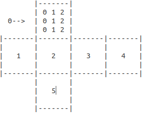

# MasterCube
AI Students Project: Rubiks Cube with Mastermind Integration

## Installation:
```
1. Clone Folder
2. Open Folder in Terminal
3. $ make
```

## Run Program:
```
1. $ ./masterCubeSolver server
2. $ ctrl + shift + t
3. $ ./masterCubeSolver client
```

## Layout



Array[6][3][3] -->
  1. Cube side range[0-5];
  2. Row range[0-2];
  3. Column range[0-2];

## How does it work?

1. Enter a number from range [2-53]
2. Be surprised


### Project Description:

The project is a combination of the Rubik's cube puzzle and the Mastermind puzzle.
1. [x] At the beginning a "server" will create a solvable Rubik's cube by applying x random
(parameter given to the server program e.g.: 100) turns (see here) on all possible
cube-sides on a cube that will have 6 different colors (red, green, blue, white, yellow, orange (not necessarily a standard "cube")) and create a client.
2. [x] The "client" will be able to connect to the server and ask the server questions in the form of a "cube"-question
(giving colors at positions (max c colors (c<<6) and max n positions (n<<9*6)))
3. [x] The "client" will also be able to give commands to the server on how to turn the cube or cube sides in a standardized fashion (see here).
4. [ ] The "server" will answer the "cube"-question in a "MasterMind" fashion. See Meaning of received Numbers.
 The positions of the 0,1,2 in the array won't give any hint about the positions of the colors nor the sides.
5. [ ] The "server" will additionally answer the "client" if the Rubik's cube is solved or not solved - by returning 0 (not solved) or 1 (solved) and then exiting.

The "client" has to solve the Rubik's cube in an efficient way.
Trivial solutions aren't part of this project (e.g. first guess the colors (pure MasterMind) and then solve the cube (pure DFS, A* or RBFS-Algorithm)). The solving can and has to already start before all the colors-positions are proven.
You'll have to find arguments/strategies on "when" to start solving (turning) the cubes-sides.
Due to the structure of this problem there are heuristic functions implemented (From a pure Masterproblem to a Rubik's cube problem).

### Meaning of received Numbers

- 0: Wrong Side
- 1: Correct color
- 2: Correct color & Position

## Credits
Credits to [ekuecks](https://github.com/ekuecks/rubiks-cube) for rubiks cube solver.
