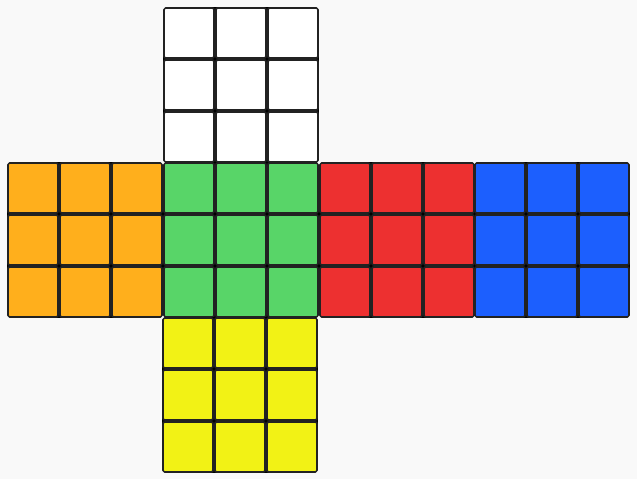

# mpk_AIproject_group3
AI Project Rubiks Cube with Mastermind Integration
Students Project


## Installation:

```
1. Clone Folder
2. Open Folder in Terminal

3. $ ./server
4. $ ctrl + shift + t
5. $ ./client
```


## Layout


Array[6][3][3] -->
  1. Cube side range[0-5];
  2. Row range[0-2];
  3. Column range[0-2];

  
See [this webside](https://www.rubiks-cube-solver.com) for detailed information about the layout.

## How does it work?

1. Enter a number from range [2-53]
2. Be surprised

### Purpose:

Purpose of this code is to combine a rubiks cube solver with mastermind.
Credits to: [ekuecks](https://github.com/ekuecks/rubiks-cube) for the code of the Solver
and [taylorjg](https://github.com/taylorjg/mastermind-cpp) for the mastermind solver.


### Logic of the code:

1. At the beginning a "server" will create a solvable Rubik's cube by applying x random
(parameter given to the server program e.g.: 100) turns (see here) on all possible
cube-sides on a cube that will have 6 different colors (red, green, blue, white, yellow, orange (not necessarily a standard "cube")) and create a client.
2. The "client" will be able to connect to the server and ask the server questions in the form of a "cube"-question
(giving colors at positions (max c colors (c<<6) and max n positions (n<<9*6)))
3. The "client" will also be able to give commands to the server on how to turn the cube or cube sides in a standardized fashion (see here).
4. The "server" will answer the "cube"-question in a "MasterMind" fashion. Black (1) is returned (in an unsorted array)
 if a color is given at the correct position. White (0) is returned (in an unsorted array) if a color is given at the correct side of the cube.
 Nothing (2) is returned (in an unsorted array) if a color is neither given at the correct position nor on the correct side.
 The positions of the 0,1,2 in the array won't give any hint about the positions of the colors nor the sides.
5. The "server" will additionally answer the "client" if the Rubik's cube is solved or not solved - by returning 0 (not solved) or 1 (solved) and then exiting.

### Logic of CubeSolver:

1. solveTopCross (edges)
2. solveTopCorners
3. solveMiddleLayer
4. solveBottomLayer

# Still in progress!
